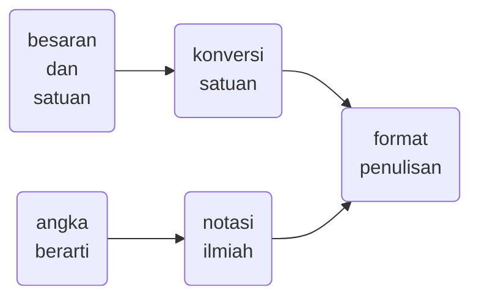

<<<<<<< HEAD
# kuno
texts, notes, scripts, codes kuno 
=======
# elementary-physics
<<<<<<< HEAD
Elementary physics notes in Indonesian language with Markdown, SVG, and Mermaid.
>>>>>>> 6a9965c (Initial commit)
=======
Elementary physics notes in Indonesian language with Markdown, Scalar Vector Graphics, and Mermaid.

## content

+ 01 besaran dan satuan, konversi satuan, angka berarti, notasi ilmiah.
+ 02 kinematika, gerak lurus beraturan, gerak lurus berubah beraturan.
+ 03 dinamika, hukum-hukum Newton, diagram bebas benda.
+ 04 gaya dan kerja, energi kinetik, teorema kerja dan gaya kinetik.
+ 05 gaya konservatif, hukum kekekalan energi mekanik.
+ 06 momentum, impuls, gaya sesaat, hukum kekekalan momentum.
+ 07 kinematika gerak melingkar, gerak melingkar beraturan, gerak melingkar berubah beraturan.
+ 08 dinamika rotasi, torsi, hukum-hukum Newton untuk gerak rotasi.
>>>>>>> 2d681c9 (update)
