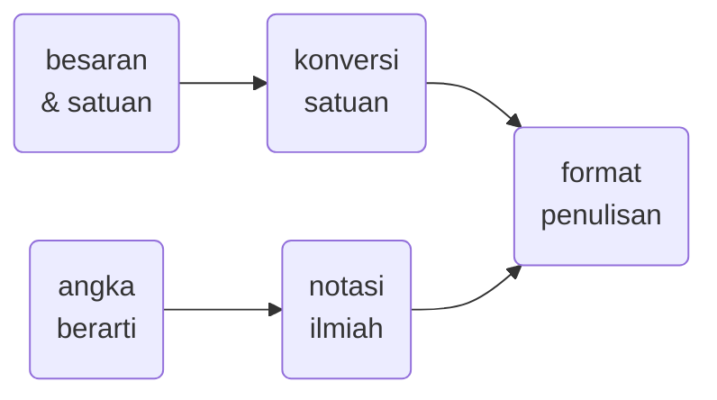

<<<<<<< HEAD
# kuno
texts, notes, scripts, codes kuno 
=======
# elementary-physics
<<<<<<< HEAD
<<<<<<< HEAD
Elementary physics notes in Indonesian language with Markdown, SVG, and Mermaid.
>>>>>>> 6a9965c (Initial commit)
=======
Elementary physics notes in Indonesian language with Markdown, Scalar Vector Graphics, and Mermaid.
=======
Notes on [Elementary physics](https://en.wikipedia.org/wiki/Outline_of_physics#General_concepts_of_physics) with [Markdown](https://www.markdownguide.org/), [Scalable Vector Graphics](https://developer.mozilla.org/en-US/docs/Web/SVG), and [Mermaid](https://mermaid-js.github.io/mermaid/), written in [Indonesian language](https://www.expat.or.id/info/historyofbahasaindonesia.html) and stored in [GitHub](https://github.com/) for you to [fork and clone](https://github.community/t/the-difference-between-forking-and-cloning-a-repository/10189).
>>>>>>> 74201b3 (update)

## content
<<<<<<< HEAD

+ 01 besaran dan satuan, konversi satuan, angka berarti, notasi ilmiah.
+ 02 kinematika, gerak lurus beraturan, gerak lurus berubah beraturan.
+ 03 dinamika, hukum-hukum Newton, diagram bebas benda.
+ 04 gaya dan kerja, energi kinetik, teorema kerja dan gaya kinetik.
+ 05 gaya konservatif, hukum kekekalan energi mekanik.
+ 06 momentum, impuls, gaya sesaat, hukum kekekalan momentum.
+ 07 kinematika gerak melingkar, gerak melingkar beraturan, gerak melingkar berubah beraturan.
+ 08 dinamika rotasi, torsi, hukum-hukum Newton untuk gerak rotasi.
>>>>>>> 2d681c9 (update)
=======
1. Kinematika Benda Titik: Overview Fisika, Review Vektor, Review Kinematika Benda titik.
2. Kinematika: Kecepatan dan percepatan. Persamaan Kinematika, Gerak 1 dimensi, gerak 2-3 dimensi, dan kecepatan relatif.
3. Dinamika benda titik: Inersia, Hukum Newton I, II dan III. Gaya dangerak Aplikasi Hukum Newton: Benda dalam keadaan seimbang dan dinamik, Diagram gaya.
4. Dinamika benda titik: Gaya gesekan, gaya normal, gaya tegangan, gaya gravitasi Newton. Analisis benda yang tergantung atau bertumpuk, benda dalam katrol, gerak melingkar, dan gaya sentripetal.
5. Usaha dan energi: Definisi usaha, energi kinetik, dan teorema usaha-energi kinetik. Energi potensial. Gaya konsevatif. Hukum kekekalan energi. Gaya tak konservatif.
6. Momentum linear: Momentum dan impuls, Sistem partikel, hukum kekekalan momentum linear, peristiwa tumbukan. Gerak titik pusat massa
7. Benda Tegar: Statika dan Dinamika rotasi sistem benda tegar.
8. Benda Tegar: Dinamika Rotasi sistem benda tegar,Gerak menggelinding.
9. Elastisitas dan osilasi: Stress, strain, modulus Young, Modulus geser dan modulus benda (bulk), Osilasi harmonik dan osilasi teredam, resonansi.
10. Gelombang Mekanik: Gelombang tali, Gelombang bunyi, Superposisi gelombang, Gelombang berdiri, Resonansi, Efek Doppler.
11. Fluida Statik dan Dinamik: Tekanan hidrostatik Gaya Archimedes Hukum Kontinuitas Hukum Bernoulli.
12. Teori Kinetik Gas: Gas ideal, asas ekipartisi energi, energi dalam, kapasitas kalor.
13. Hukum-0 dan 1 Thermodinamika: Keseimbangan termal, Proses kuasistatik umum, Proses khusus (isobar, isovolum, isotherm, adiabatik) Diagram (P,V), Usaha, Hukum I Termodinamika.
14. Hukum-2 Thermodinamika: Proses siklus, Efisiensi, Konsep hukum II Thermodinamika: Clausius Kelvin Carnot Pengenalan entropi.
15. Pembelejaran Berbasis Riset dengan Topik Mekanika, Fluida, dan Termodinamika.
16. Elektrostatika: Hukum Coulomb & Medan listrik	Muatan listrik Gaya dan medan listrik oleh muatan diskrit & muatan terdistribusi kontinu.
17. Elektrostatika: Hukum Gauss	Fluks listrik, Hukum Gauss Konduktor dan isolator, muatan induksi.
18. Elektrostatika: Potensial listrik.	Energi potensial listrik dan Potensial listrik oleh muatan diskrit dan kontinu.
19. Elektrostatika: Kapasitor dan dielektrik	Kapasitor (pelat sejajar, bola sepusat, silinder sesumbu), susunan kapasitor, dielektrik.
20. Magnetostatika: Medan Magnet	Gaya Lorentz, gaya magnet pada konduktor berarus pada konduktor berarus
21. Magnetostatika: Medan Magnet oleh Arus listrik	Hukum Biot-Savart Hukum Ampere Gaya antar kawat berarus
22. Induksi elektromagnetik	Hukum Faraday-Lenz Induktansi diri dan mutual.
23. Arus bolak balik (AC)	Arus & tegangan rms, Impedansi, analisis rangkaian RLC seri, resonansi.
24. Gelombang elektromagnetik	Persamaan Maxwell dan pers. Diff. Gelombang EM Pers. Gel. EM Energi gelombang EM, vektor Poynting, Polarisasi
25. Interferensi	Interferensi 2 celah dan N celah, Interferensi lapisan tipis
26. Difraksi	Difraksi, Interferensi-Difraksi
27. Fisika Modern: Teori Relativitas Khusus	Relativitas waktu dan panjang, transformasi Lorentz, relativitas kecepatan, momentum dan energi.
28. Fisika Modern: Foton dan gelombang materi	Foton, gelombang-cahaya, efek fotolistrik, momentum foton, elektron dan gelombang-materi.
29. Fisika Atom & Fisika material	Topik-topik khusus yang berkaitan dengan kekinian seperti: laser, semi-superkonduktor, fisika nuklir, nanoscience.
30. Pembelejaran Berbasis Riset dengan Listik-Magnet, Cahaya, dan Fisika Moderen.
>>>>>>> 7b08069 (update)
